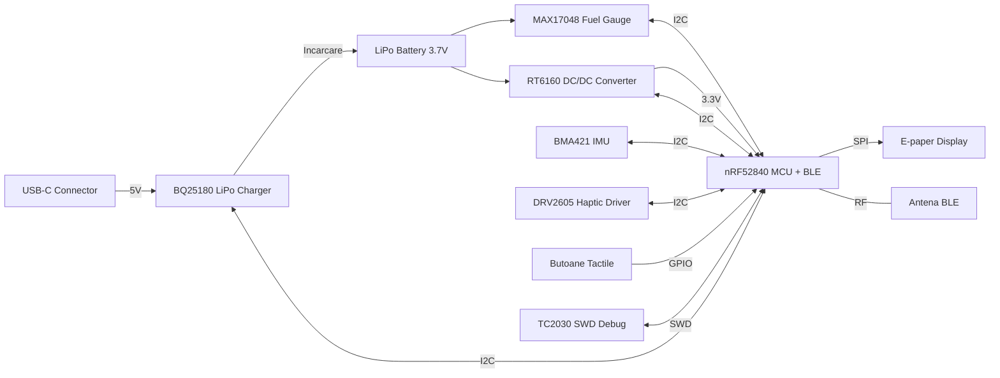

# InkTime Smart Watch

### Diagrama bloc

### BOM (Bill of Materials)

| Componentă | Descriere | Capsulă | Link JLC Parts | Datasheet |
| :--- | :--- | :--- | :--- | :--- |
| **nRF52840-QIAA-R** | MCU Bluetooth 5.4, ARM Cortex-M4F | aQFN73 | [Link JLC (C190794)](https://jlcpcb.com/parts/componentSearch?searchTxt=C190794) | [Datasheet](https://www.nordicsemi.com/Products/nRF52840) |
| **BQ25180YBGR** | LiPo Charger & Power Path | DSBGA-8 | [Link JLC (C3682423)](https://jlcpcb.com/parts/componentSearch?searchTxt=C3682423) | [Datasheet](https://www.ti.com/product/BQ25180) |
| **RT6160AWSC** | Buck-Boost DC/DC Converter 3.3V | WLCSP-15 | [Link JLC (C7065276)](https://jlcpcb.com/parts/componentSearch?searchTxt=C7065276) | [Datasheet](https://www.richtek.com/Products/Switching%20Regulators/Buck-Boost%20Converter/RT6160A) |
| **MAX17048G+T10** | Fuel Gauge (Baterie) | DFN-8 | [Link JLC (C2682616)](https://jlcpcb.com/parts/componentSearch?searchTxt=C2682616) | [Datasheet](https://www.analog.com/en/products/max17048.html) |
| **BMA421** | Accelerometru (Pedometer) | LGA-12 | [Link JLC (C5242966)](https://jlcpcb.com/parts/componentSearch?searchTxt=C5242966) | [Datasheet](https://www.bosch-sensortec.com/products/motion-sensors/accelerometers/bma421/) |
| **DRV2605LDGSR** | Haptic Driver (Vibrații) | VSSOP-10 | [Link JLC (C527464)](https://jlcpcb.com/parts/componentSearch?searchTxt=C527464) | [Datasheet](https://www.ti.com/product/DRV2605L) |
| **LCM1027B3605F** | Motor vibrații ERM | Wire | [Link JLC (C7528806)](https://jlcpcb.com/parts/componentSearch?searchTxt=C7528806) | [Datasheet](https://www.tme.eu/ro/details/lcm1027b3605f/motoare-dc/liwang-micro-motor/) |
| **SI2301CDS** | P-Channel MOSFET | SOT-23 | [Link JLC (C10487)](https://jlcpcb.com/parts/componentSearch?searchTxt=C10487) | [Datasheet](https://www.vishay.com/product?docid=66709) |
| **Cristal 32MHz** | Cuarț extern (HFXO) | 2016-4P | [Link JLC (C394947)](https://jlcpcb.com/parts/componentSearch?searchTxt=C394947) | [Datasheet](https://www.lcsc.com/product-detail/C394947.html) |
| **Cristal 32.768kHz**| Cuarț extern (LFXO) | 3215-2P | [Link JLC (C32346)](https://jlcpcb.com/parts/componentSearch?searchTxt=C32346) | [Datasheet](https://www.lcsc.com/product-detail/C32346.html) |
| **Inductor 0.47µH** | Inductor putere (RT6160) | 0805 | [Link JLC (C2828026)](https://jlcpcb.com/parts/componentSearch?searchTxt=C2828026) | [Datasheet](https://www.lcsc.com/product-detail/C2828026.html) |
| **Cond. 100nF** | Decuplare (Standard) | 0201 | [Link JLC (C30733)](https://jlcpcb.com/parts/componentSearch?searchTxt=C30733) | [Datasheet](https://www.lcsc.com/product-detail/C30733.html) |
| **Cond. 10µF** | Filtrare (RT6160, BQ SYS) | 0402 | [Link JLC (C15525)](https://jlcpcb.com/parts/componentSearch?searchTxt=C15525) | [Datasheet](https://www.lcsc.com/product-detail/C15525.html) |
| **Rezistență 10kΩ** | Pull-up magistrală I2C | 0201 | [Link JLC (C32512)](https://jlcpcb.com/parts/componentSearch?searchTxt=C32512) | [Datasheet](https://www.lcsc.com/product-detail/C32512.html) |

### Descrierea functionalitaii hardware

Dispozitivul InkTime este proiectat ca un smartwatch ultra-low power, optimizat pentru o autonomie ridicată și o interfață utilizator "glanceable" (E-paper). Arhitectura hardware este construită în jurul nucleului nRF52840, utilizând o magistrală I2C partajată pentru senzori și o interfață SPI rapidă pentru afișaj.

1. Unitatea Centrală de Procesare (MCU)
Inima dispozitivului este SoC-ul Nordic nRF52840. Acesta a fost ales pentru raportul excelent performanță/consum și suportul nativ pentru Bluetooth 5.0 Low Energy. Dispune de un nucleu ARM Cortex-M4F la 64 MHz, 1 MB Flash și 256 KB RAM. Gestionează logica sistemului prin SPI (Display), I2C (Senzori și Power Management) și GPIO (Butoane și întreruperi).

2. Sistemul de Alimentare și Managementul Bateriei
Sistemul este alimentat de o baterie LiPo de 250 mAh, gestionată astfel:
* Încărcare: Conectorul USB-C (cu protecție ESD USBLC6-2SC6Y) furnizează 5V către charger-ul BQ25180YBGR. Curentul este limitat hardware la 350mA pentru siguranță.
* Monitorizare (Fuel Gauge): Integratul MAX17048 măsoară starea bateriei (SoC) folosind algoritmul ModelGauge și comunică prin I2C, alertând MCU-ul când bateria este descărcată.
* Reglare: Convertorul Buck-Boost RT6160AWSC stabilizează tensiunea bateriei la un rail constant de 3.3V, necesar senzorilor și procesorului, operând la 1.5MHz cu un inductor de 10µH.

3. Interfața Vizuală (Display E-Paper)
Se utilizează un panou E-paper de 1.54 inch (200x200 px), conectat prin FFC (24 pini). Comunicația se face via SPI (MOSI, SCK), asistată de pinii de control CS, DC, RST și BUSY. Circuitul de drive include un inductor de 68µH și diode Schottky pentru generarea tensiunilor înalte de polarizare. Avantajul major este consumul zero în standby (afișaj bistabil).

4. Senzori și Feedback Tactil
* IMU (BMA421): Accelerometru 3-axis folosit pentru pedometru integrat și detectarea orientării/mișcării (tilt-to-wake). Comunică pe I2C și folosește pinii INT1/INT2 pentru a trezi MCU-ul.
* Haptic (DRV2605YZFR): Driver I2C ce controlează motorul de vibrații ERM, folosind o bibliotecă internă de peste 100 de efecte tactile pre-programate pentru notificări.

5. Conectivitate BLE și RF
Radio-ul Bluetooth 5.0 integrat în nRF52840 comunică cu exteriorul printr-o antenă ceramică Johanson (2450AT18B100E) și o rețea de matching RF (15nH, 3.9nH, 1pF). Antena este plasată pe marginea PCB-ului, deasupra unui decupaj complet al planului de masă pentru a preveni atenuarea semnalului.

6. Butoane, Debug și Oscilatoare
* Control: Trei butoane tactile cu rezistențe pull-up de 10kΩ, conectate direct la GPIO-uri.
* Debug: Interfață SWD accesibilă printr-un footprint Tag-Connect (TC2030-IDC) cu 6 pini (SWDIO, SWDCLK, SWO, RESET, 3V3, GND).
* Clocking: Un cristal extern de 32 MHz (HFXO) pentru sistem/BLE și un cristal de 32.768 kHz (LFXO) pentru Real-Time Clock (RTC).

7. Calcul Consum de Energie

| Componentă | Curent Tipic | Mod Funcționare |
| :--- | :--- | :--- |
| **nRF52840** | 4.8 mA | Activ (CPU procesare) |
| **nRF52840** | 0.4 µA | Deep sleep (RTC activ) |
| **nRF52840** | 5.3 mA | BLE Advertising |
| **BMA421** | 150 µA | Normal (Monitorizare pași) |
| **BMA421** | 2 µA | Low power standby |
| **DRV2605** | 9 mA | Activ (Vibrație) |
| **DRV2605** | 40 µA | Standby |
| **MAX17048** | 23 µA | Activ (Monitorizare baterie) |
| **RT6160AWSC** | ~50 µA | Quiescent (Așteptare) |
| **Display E-paper**| ~26 mA | Refresh imagine (1-2 secunde) |
| **Display E-paper**| 0 mA | Standby (Imagine persistentă) |

Estimare autonomie: Cu bateria LiPo de 250mAh, presupunând un regim normal de utilizare (sleep majoritatea timpului, refresh ecran periodic, BLE activ intermitent), curentul mediu de descărcare este estimat la ~1.2 mA. Autonomia teoretică rezultată este de 8-9 zile.

## Pinout și Interfețe nRF52840

Pentru a optimiza spațiul pe PCB și a minimiza lungimea traseelor, pinii microcontroller-ului au fost alocați strategic în funcție de capabilitățile lor hardware (ex: suport nativ USB, High-Drive pentru semnale rapide) și poziționarea fizică a componentelor.

| Pin nRF52840 | Nume Semnal | Componentă | Interfață | Rol / Motivul alocării |
| :--- | :--- | :--- | :--- | :--- |
| **P0.00 / XL1** | `XL1` | Cristal 32 MHz | XTAL | Pin dedicat hardware pentru oscilatorul principal (HFXO), necesar pentru radio BLE. |
| **P0.01 / XL2** | `XL2` | Cristal 32 MHz | XTAL | Pin dedicat hardware pentru oscilatorul principal (HFXO). |
| **P0.00 (XC1)** | `XC1` | Cristal 32.768kHz | XTAL | Pini dedicați pentru oscilatorul low-power (LFXO), esențial pentru funcția de RTC în deep-sleep. |
| **P0.01 (XC2)** | `XC2` | Cristal 32.768kHz | XTAL | Pini dedicați LFXO. |
| **P0.04** | `EPD_CS` | Display E-Paper | SPI (CS) | Chip Select. Alocat pe un pin cu capabilitate de comutare rapidă. |
| **P0.05** | `EPD_DC` | Display E-Paper | GPIO | Data/Command select. Controlează interpretarea pachetelor SPI. |
| **P0.06** | `MOSI` | Display E-Paper | SPI | Master Out Slave In. Rutat pe un pin High-Drive pentru integritatea semnalului la 8 MHz. |
| **P0.07** | `SCK` | Display E-Paper | SPI | Serial Clock pentru sincronizarea datelor către ecran. |
| **P0.08** | `EPD_RST` | Display E-Paper | GPIO | Reset hardware pentru panoul e-paper. |
| **P0.09** | `EPD_BUSY`| Display E-Paper | GPIO | Semnal de intrare. MCU-ul așteaptă ca acest pin să devină LOW înainte de a trimite cadre noi. |
| **P0.13** | `D-` | Conector USB-C | USB | Pin dedicat hardware pentru magistrala de date USB nativă a nRF52840. |
| **P0.14** | `D+` | Conector USB-C | USB | Pin dedicat hardware pentru magistrala de date USB nativă a nRF52840. |
| **P0.25** | `SDA` | Magistrala I2C | I2C | Serial Data. Partajat între senzori (BMA421, DRV2605, BQ25180, MAX17048) pentru a economisi pini. |
| **P0.26** | `SCL` | Magistrala I2C | I2C | Serial Clock. Rutat centralizat către toate IC-urile de pe placa de bază. |
| **P0.27** | `CHG_INT` | BQ25180 (Charger) | GPIO (Int) | Întrerupere de la charger. Trezește MCU-ul când se conectează/deconectează cablul USB. |
| **P0.28** | `BAT_ALRT`| MAX17048 (Gauge) | GPIO (Int) | Întrerupere Fuel Gauge. Alertează MCU-ul când nivelul bateriei scade sub pragul critic (ex: 10%). |
| **P1.01** | `HAPTIC_EN`| DRV2605 (Driver) | GPIO | Enable hardware. Ține driver-ul de vibrații oprit fizic (0 µA) când nu este utilizat. |
| **P1.02** | `IMU_INT1`| BMA421 (IMU) | GPIO (Int) | Întrerupere accelerometru. Folosit pentru funcția de wake-on-motion (ridicarea mâinii). |
| **P1.03** | `IMU_INT2`| BMA421 (IMU) | GPIO (Int) | Întrerupere secundară IMU (ex: pentru raportarea pragului de pași atins - pedometru). |
| **P1.04** | `BTN_UP` | Buton Tactil 1 | GPIO | Configurat cu rezistență internă de Pull-up. Declanșează evenimente la tranzitia spre GND (apăsare). |
| **P1.05** | `BTN_DN` | Buton Tactil 2 | GPIO | Configurat cu rezistență internă de Pull-up. |
| **P1.06** | `BTN_ENT` | Buton Tactil 3 | GPIO | Configurat cu rezistență internă de Pull-up. |
| **P0.18 / RES**| `RESET` | Interfață SWD | SWD | Pin hardware pentru resetarea procesorului din exterior (Tag-Connect). |
| **SWDCLK** | `SWDCLK` | Interfață SWD | SWD | Clock pentru programare/depanare via TC2030-IDC. |
| **SWDIO** | `SWDIO` | Interfață SWD | SWD | Date bidirecționale pentru programare/depanare. |
| **ANT** | `RF` | Antenă BLE | RF | Pinul fizic de ieșire al radioului de 2.4GHz către rețeaua de matching. |
| **VBUS** | `VBUS` | Conector USB-C | Power | Detecție hardware VBUS. Permite MCU-ului să știe când rulează pe USB vs. Baterie. |
